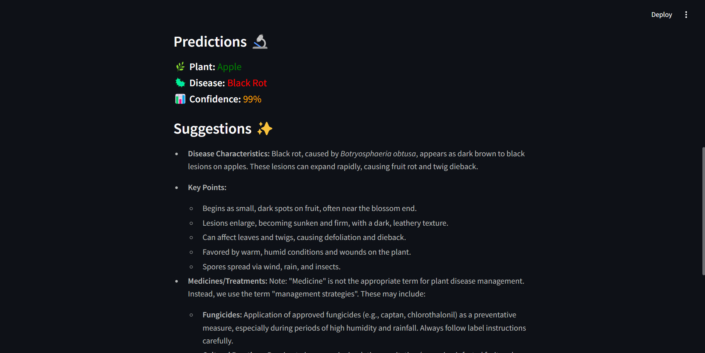

---

# 🌾 KrishIntel AI  

**KrishIntel AI** is an advanced AI-powered solution designed to empower farmers with efficient crop management and disease diagnosis tools. By leveraging cutting-edge technologies like CNN, Xception architecture, and RAG, this project offers an intuitive, farmer-friendly interface that supports multiple regional languages.  

---

## 📊 **Why KrishIntel AI?**  
- **Exceptional Accuracy:**  
  KrishIntel AI achieves a remarkable **99% accuracy** on both training and validation datasets. This surpasses the performance of models documented in [this research](https://openagriculturejournal.com/VOLUME/18/ELOCATOR/e18743315305194/).  
- **Comprehensive Coverage:**  
  Detects diseases in **38 plant categories**, including major crops like potato, tomato, apple, and corn.  
- **Intelligent Interaction:**  
  Combines **CNN-based disease detection** with **Retrieval-Augmented Generation (RAG)** to provide context-aware, actionable insights in **regional languages**.  

---

## 🚀 **Features**  
- **High Accuracy:** Built using the Xception architecture, achieving state-of-the-art performance.  
- **Wide Range of Crops:** Supports 38 crop categories for disease classification.  
- **Regional Language Support:** Enables intuitive interaction with farmers.  
- **User-Friendly UI:** Developed using **Streamlit** for an interactive experience.  
- **Scalable & Portable:** Containerized with **Docker** for easy deployment.  

---

## 📷 **Project Visuals**  
Here are some visuals showcasing the functionality of KrishIntel AI:  
  
---
  
---
<div style="display: flex; justify-content: space-around;">
  
  
</div>
  

---

## 🛠️ **How to Use**  

### **Setting Up with Docker**  
# KrishIntel AI - Docker Image

This guide explains how to pull and run the **KrishIntel AI** Docker image from Docker Hub.

## Prerequisites
1. Install [Docker](https://docs.docker.com/get-docker/) on your system.
2. Ensure Docker is running.

---

## Pull the Docker Image
Use the following command to pull the Docker image from Docker Hub:
```bash
docker pull thyakash/krishintelai:v1.0
docker run -p 8501:8501 thyakash/krishintelai:v1.0
```

### **Using AI Features**  
To use the AI-powered features, update the API keys in the `.env` file with your own credentials.  

---

## 🏆 **Achievements**  
KrishIntel AI outperforms models like AlexNet and SqueezeNet as documented in [this research](https://openagriculturejournal.com/VOLUME/18/ELOCATOR/e18743315305194/), setting a new benchmark in crop disease detection with its **99% accuracy**.  

---

## 🔗 **Live Demo Video**  
Check out the live demo of KrishIntel AI on my [LinkedIn post](https://www.linkedin.com/posts/thyakash_artificialintelligence-agriculture-deeplearning-activity-7283548887762530304-rxv2?utm_source=share&utm_medium=member_desktop) to see the project in action!  

---

## 🤝 **Connect with Me**  
Feel free to reach out or collaborate! Connect with me on [LinkedIn](https://www.linkedin.com/in/thyakash).  

